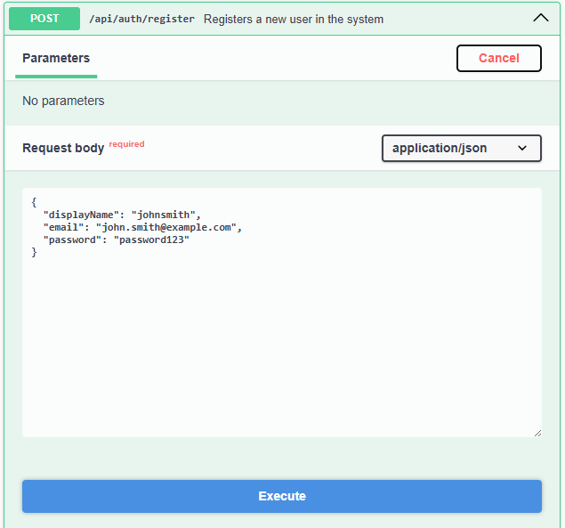
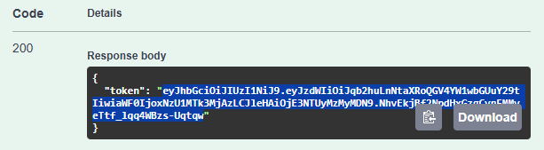
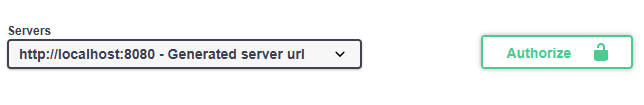
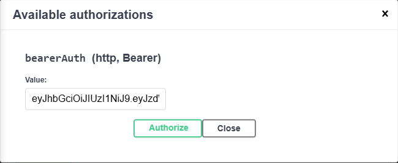
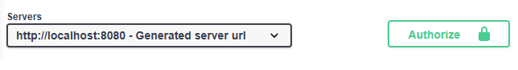
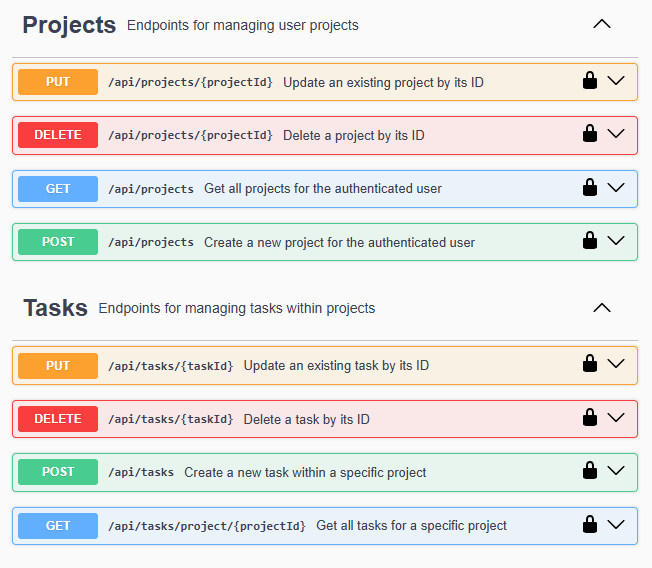

# Task Manager API

This repository contains the source code for a REST API designed to manage tasks, built with Spring Boot. It was developed as a portfolio project to demonstrate a clean, modern architecture using best development practices.

The core idea is simple: allow users to securely register and authenticate. Once logged in, they can create personal projects. Within each project, they can add, modify, and organize their tasks. Security is a key aspect, so a user can never see or interact with projects and tasks belonging to others.

## What can you do with this API?

- **Robust User Authentication:** A secure system for user registration and login using JSON Web Tokens (JWT).
- **Full Project Management:** Full CRUD (Create, Read, Update, Delete) operations for a user's own projects.
- **Task Organization:** The same CRUD capabilities for tasks, which are always linked to one of the user's projects.
- **Scoped Security:** Endpoints are protected to ensure users can only access their own data.
- **Interactive API Documentation:** The API self-generates its documentation with Swagger, which is perfect for visually and quickly testing every endpoint.

## Tech Stack

- **Language:** Java 21
- **Framework:** Spring Boot 3.5.3
- **Security:** Spring Security
- **Database:** Spring Data JPA with Hibernate, connected to a MySQL database.
- **Dependencies:** Managed with Maven.
- **Authentication:** JSON Web Tokens (JWT).
- **Documentation:** SpringDoc (Swagger/OpenAPI).
- **Utilities:** Lombok and Spring Dotenv.

## Prerequisites

To get this project up and running on your local machine, you'll need:

- JDK 21 or higher.
- Maven 3.8 or higher.
- A running MySQL server instance.

## Local Setup

Follow these steps to configure and run the application.

**1. Clone the Repo**

First things first, get the code on your machine. Open a terminal and run:

```bash
git clone <YOUR_REPOSITORY_URL>
cd task-manager-api
```

**2. Set Up the Database**

The API is designed for a straightforward setup.

- You don't need to create the database manually; the application will create `tasklist_db` for you on its first run.
- Just make sure the credentials in `src/main/resources/application.properties` match your local MySQL setup. The default is set for a `root` user with no password. If your configuration is different, just update it there.

**3. Configure the JWT Secret**

For security, the secret key used to sign JWTs is not hardcoded. Instead, it's loaded from an environment variable.

- In the project's root directory (the same level as `pom.xml`), create a file named `.env`.
- Inside this file, you need to define the `JWT_SECRET`. We strongly recommend generating a cryptographically secure key.

  - **Recommended (Unix-like systems):** If you're on Linux, macOS, or using Git Bash on Windows, you can generate one with `openssl`:
    ```bash
    openssl rand -base64 32
    ```
    Copy the output of that command.
  - **Alternative:** If you don't have `openssl`, any trusted online password generator can create a long, random string for you.

- Your `.env` file should look like this:
  ```
  JWT_SECRET=your_super_long_and_secure_generated_key_here
  ```

**4. Build and Run the App!**

With everything configured, it's time to compile and run the server.

- From your terminal in the project root, run:
  ```bash
  mvn clean install
  ```
- And to start it:
  `bash
    mvn spring-boot:run
    `
  If all goes well, you'll see the Spring Boot logs in your console, indicating the server is up and running on port **8080**.

## How to Test the API with Swagger

The easiest way to play with the API is through the built-in Swagger UI.

**1. Access the Documentation**

- With the project running, open your browser and navigate to: [http://localhost:8080/swagger-ui.html](http://localhost:8080/swagger-ui.html)

**2. The Testing Workflow**
To test the protected endpoints (for projects and tasks), the flow is always the same: register, log in to get a token, and use that token to authorize your subsequent requests.

A great feature of Swagger is that for each operation, it provides an **Example Value** in the request body. You can click "Try it out" and use this JSON as a template, filling it with your own data.

- **First, register a user:** Find the `Authentication` section, expand `POST /api/auth/register`, and click "Try it out" to send the data for a new user.

  

- **Second, log in:** Now, use the `POST /api/auth/login` endpoint with the email and password you just registered. The response will contain a JWT `token`. **Copy the entire token string.**

  

- **Third, authorize your requests:**

  1.  At the top right of the page, click the green **`Authorize`** button.

      

  2.  In the pop-up window, find the `Value` field for `bearerAuth`.
  3.  **Simply paste the token string you copied from the login step.** You do not need to add the `Bearer` prefix yourself; Swagger handles that for you.

      

  4.  Click "Authorize" and close the window. You'll see that the padlock icon is now locked.

      

That's it! You're all set. Now every request you make from the Swagger UI to a protected endpoint will automatically include your authorization token, allowing you to create projects, add tasks, and manage all your resources.


